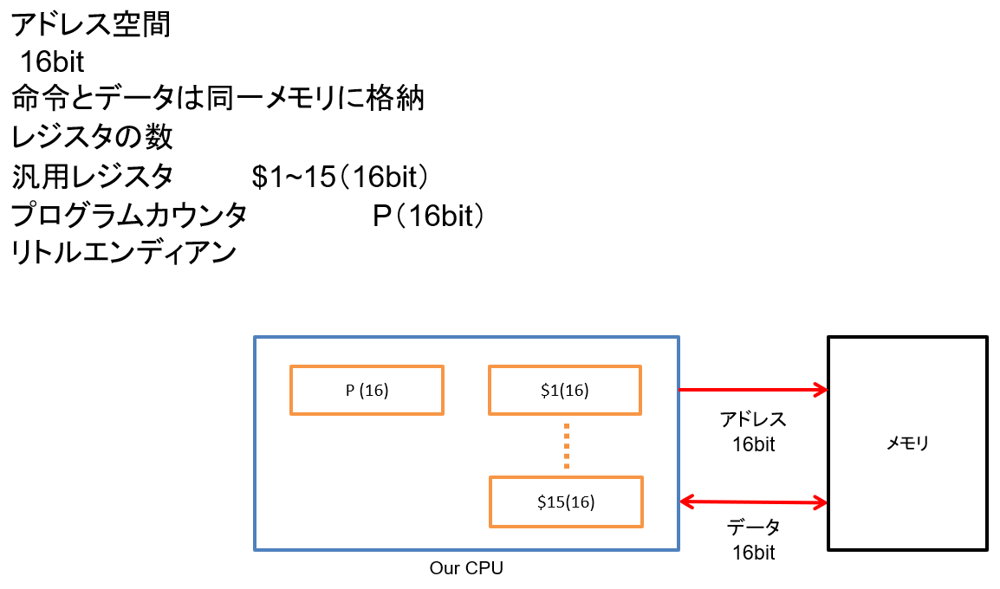

# 概要

# 命令形式

# 命令一覧
| Operator | Type | Operand  | Opecode  | Action                                       | 説明                         |
|----------|------|----------|----------|----------------------------------------------|----------------------------|
| CNST     | I    | R1,R2,I  | 00000000 | R1 ← R2+I                                    | 符号付き定数                     |
| LD1      | I    | R1,R2, I | 00000001 | R1(15:8)←0x00,R1(7:0) ← MEM[I+R2]            | １バイトロードする                  |
| LD2      | I    | R1,R2, I | 00000010 | R1(15:8) ← MEM[I+R2+1]; R1(7:0) ← MEM[I+R2]  | ２バイトロードする                  |
| ST1      | I    | R1,R2, I | 00000011 | MEM[I+R2] ← R1(7:0)                          | １バイトストアする                  |
| ST2      | I    | R1,R2, I | 00000100 | MEM[I+R2+1] ← R1(7:0); MEM[I+R2] ← R1(15:8); | ２バイトストアする                  |
| JUMP     | I    | R2,I     | 00000101 | P ← R2+I                                     | 無条件分岐                      |
| CALL     | I    | R1,R2,I  | 00000110 | P ← R2+I, R1 ← P+4                           | コール                        |
| JEQ      | I    | R1,R2,I  | 00000111 | P ← if（R1 == R2） I                           | 条件分岐                       |
| JGEI     | I    | R1,R2,I  | 00001000 | P ← if(R1 >= R2) I                           | 符号付き条件分岐                   |
| JGEU     | I    | R1,R2,I  | 00001001 | P ← if(R1 >= R2) I                           | 符号無し条件分岐                   |
| JGTI     | I    | R1,R2,I  | 00001010 | P ← if(R1 > R2) I                            | 符号付き条件分岐                   |
| JGTU     | I    | R1,R2,I  | 00001011 | P ← if(R1 > R2) I                            | 符号無し条件分岐                   |
| JLEI     | I    | R1,R2,I  | 00001100 | P ← if(R1 <= R2) I                           | 符号付き条件分岐                   |
| JLEU     | I    | R1,R2,I  | 00001101 | P ← if(R1 <= R2) I                           | 符号無し条件分岐                   |
| JLTI     | I    | R1,R2,I  | 00001110 | P ← if(R1 < R2) I                            | 符号付き条件分岐                   |
| JLTU     | I    | R1,R2,I  | 00001111 | P ← if(R1 < R2) I                            | 符号無し条件分岐                   |
| JNE      | I    | R1,R2,I  | 00010000 | P ← if（R1 != R2） I                           | 条件分岐                       |
| MUL      | R    | R1,R2    | 10000000 | R1<15:0>←R1<7:0>*R2<7:0>                     | 乗算                         |
| CVI2     | R    | R1,R2    | 10000001 | R1(15:7) ← R2(7); R1(6:0) ← R2(6:0)          | ワードに符号拡張                   |
| ADD      | R    | R1,R2    | 10000010 | R1 ← R1 + R2                                 | 加算                         |
| SUB      | R    | R1,R2    | 10000011 | R1 ← R1 - R2                                 | 減算                         |
| NEG      | R    | R1,R2    | 10000100 | R1 ← -R2                                     | 符号反転                       |
| BAND     | R    | R1,R2    | 10000101 | R1 ← R1 and R2                               | 論理積                        |
| BOR      | R    | R1,R2    | 10000110 | R1 ← R1 or R2                                | 論理和                        |
| BXOR     | R    | R1,R2    | 10000111 | R1 ← R1 xor R2                               | 排他的論理和                     |
| BCOM     | R    | R1,R2    | 10001000 | R1 ← ^R2                                     | ビット反転                      |
| DINT     | R    |          | 10101001 | int_f =0                                     | 割り込みフラグ_OFF(int_f=割り込みフラグ) |
| EINT     | R    |          | 10101010 | int_f =1                                     | 割り込みフラグ_ON                 |
| RINT     | R    |          | 10101011 | pc←ipc,int_f =0                              | 割り込み先からの復帰（ipc=割り込み発生時のpc） |
| LSHL     | RS   | R1,R2,I4 | 1100     | R1 ← R2 << I4                                | 左論理シフト                     |
| RSHA     | RS   | R1,R2,I4 | 1101     | R1 ← R2 >>> I4                               | 符号付き右算術シフト                 |
| RSHL     | RS   | R1,R2,I4 | 1110     | R1 ← R2 >> I4                                | 右論理シフト                     |
| HLT      | RS   |          | 1111     | HLT                                          | 終了命令                       |

